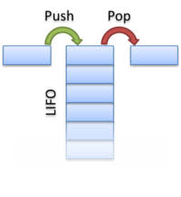

# STACK

### This program simulates the work of a real stack and debugging process

## INSTRUCTIONS
**To launch the program, you need to:**

1. **SELECT** the element type for your stack. You have **TWO** options:
* **STACK_USE_DOUBLE**
* **STACK_USE_INT**

2. **IDENTIFY** your choise to use `#ifdef`
```C
g++  -DSTACK_USE_INT -g main.cpp -o main.exe
```
3. If you wanna change programm correct you should **turn on** STACK_DEBUG:
```C
g++  -DSTACK_DEBUG -DSTACK_USE_DOUBLE -g main.cpp -o main.exe
```
## USAGE

 

 ### OPTIONS
 **NO DEBUG MODE**
 1. We can only *push* and *pop*
 2. To visualize the work of the stack you can use function `void stack_print(const struct source_location* stk);`

 **USE DEBUG MODE** + looking for imposters with the help of our main.log

## DEBUG AND PROTECION

### ERROR_CODES
You have 11 options of the most typical errors in your code:

```C
enum error_t
{
    OK                             = 0,
    NULL_POINTER                   = 1,
    OUT_OF_BOUNDS                  = 2,
    NULL_POINTER_FROM_CALLOC       = 3,
    NO_STACK_INITTED               = 4,
    BAD_ALLOCATION                 = 5,
    WRONG_CAPACITY                 = 6,
    WRONG_SIZE                     = 7,
    INVALID_LEFT_STRUCTURE_CANARY  = 8,
    INVALID_RIGHT_STRUCTURE_CANARY = 9,
    INVALID_LEFT_STACK_CANARY      = 10,
    INVALID_RIGHT_STACK_CANARY     = 11,
    INVALID_HASH                   = 12

};
```
In log file you'll see **description** of this errors. Or if you want **look in main.cpp -> stack_dump()**

### MAIN.LOG

This file helps tou to describe the error in tour programm.
It **SHOWS**:
1. Error **code** and it's description
2. **Name of file** containing error
3. **Name of function** in which was mistacke made
4. **Line** in code

Then it writes stack with all specifications
<details>
<summary>**EXAMPLE:**</summary>

```C
*************************
MEET ERROR IN YOUR PROGRAMM READ ALL INFORMATION DOWN
*************************
Error code: [10] : <CU-CU-CU Something wrong with your left stack canary protection> in file: <main.cpp> in function: <stack_pop()> in line: [124]

YOUR STACK: stack_t &stk1 = [0064FED0] created by main():
capacity = [10]
size = [1]
&data = [008615D8]
{
[-1]  = a0a0a0a0a0a0a0a           <<CANARY>>
[ 0]  = [105]
[ 1]  = [1.#QNAN]     <<POISON>>
[ 2]  = [1.#QNAN]     <<POISON>>
[ 3]  = [1.#QNAN]     <<POISON>>
[ 4]  = [1.#QNAN]     <<POISON>>
[ 5]  = [1.#QNAN]     <<POISON>>
[ 6]  = [1.#QNAN]     <<POISON>>
[ 7]  = [1.#QNAN]     <<POISON>>
[ 8]  = [1.#QNAN]     <<POISON>>
[ 9]  = [1.#QNAN]     <<POISON>>
[10]  = ba0bab           <<CANARY>>
}

*************************
END OF OUR MESSAGE
*************************
```
</details>

### CANARY PROTECTION

1. We put our *"BIRDS"* in the BEGINNING and END of the stack.
**NOTE** It has `unsigned long long` type, be carefull if you wanna change code
2. We put our *"BIRDS"* in the BEGINNING and END of the structure with all important information about stack.

<details>
<summary>VIEW OF STACK</summary>

```C
struct stack_t
{
    unsigned long long structure_canary_left = 0xDEADBEEF;
    stack_elem_t* data;
    int capacity;
    int size;
    unsigned long long stack_canary = 0xBA0BAB;
    unsigned long long structure_canary_right = 0xDEADBEEF;
};
```
</details>

### HASH PROTECTION
We use hash function to protect not only bounds of our stack, but also the filling

<details>
<summary>HASH</summary>

```C
size_t hash(unsigned char* data, size_t capacity)
{
    size_t hash = 5381;
    stack_elem_t c = 0;

    for (size_t i = 0; i < capacity; i++)
    {
        c = data[i];
        hash = ((hash << 5) + hash) + c;
    }

    return hash;
}
```
</details>

### Acknowledgements

HUGE RESPECT TO **Daniel J. Bernstein**, creator of djb2 hash function

Thank you soooo much [Stepan](https://github.com/SSStepa) for cracking my code

### [My GitHub link](https://github.com)
